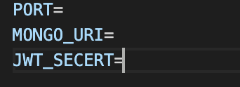
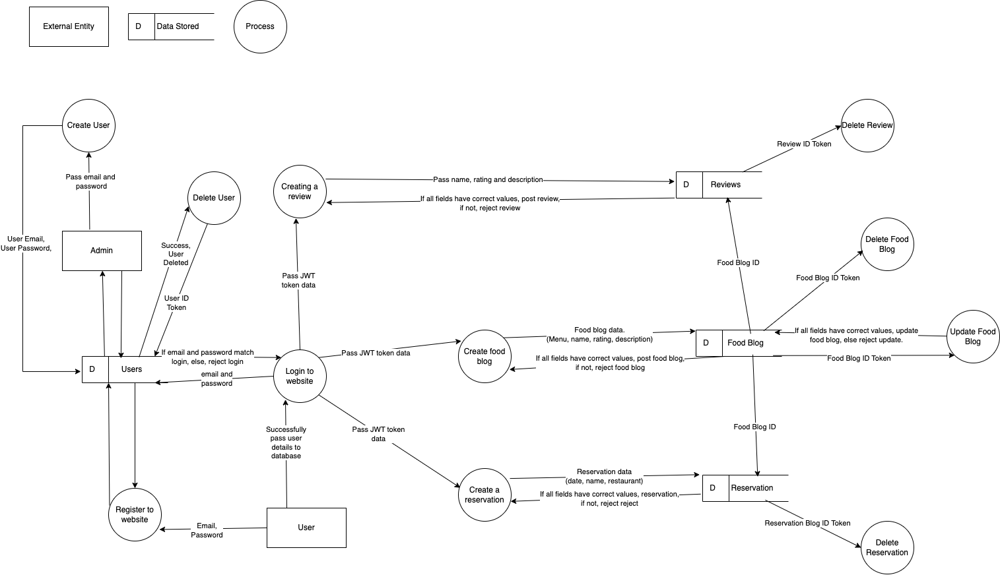
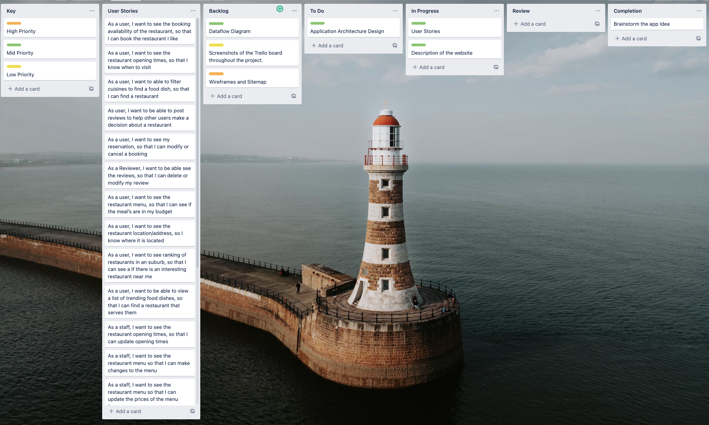
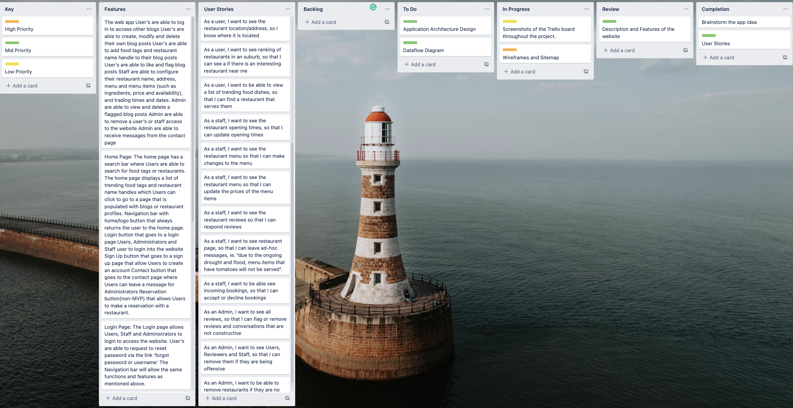

A website for Trending food  
Github link
Tommy Troung 

https://github.com/TommyT77/roondayview

David Cha 

https://github.com/david10382/roondayview

# RoondayView

Deployed Web App Link: 

https://legendary-arithmetic-c1ee45.netlify.app/

---

Part A Readme.md 

https://github.com/david10382/Readme-T3A2-A/blob/main/Readme-T3A2-A.md

---

Changes from T3A2-A

    1. (Non-MVP feature) Staff dashboard and Restaurant profile  was not implement due to time constraints
    2.(Non-MVP feature) Reservation tab relies on Restaurant Profile, was not  implemented due to time constraints
    3.(Non-MVP feature) Image upload with new blog posts 

---
# Installation Guide

Installation Guide for Front end/Back end : 

    1. run `npm install`

then 

    2. run `npm start`

# Setting Up the env file

There's a sample env file in the backend folder. You can use that to fill in your jwt secrets and set up your own mongodb. 

Back-end Dependencies:
	
	
    Bcrypt
    Cors
    Dotenv
    Express
    Helmet
    Jsonwebtoken
    Mongoose
    Jest
    Supertest
    nodemon

Front-end Dependencies

	
	Axios 
    emotion/react
    emotion/styled
    mui/icons-material
    mui/lab
    mui/material
    mui/styles
    autosuggest-highlight
    styled-components

	

---
# User Manual testing 

User manual testing was undertaken to catch any bugs along the userflow. Below is a link to a spreadsheet accounting to different users and their test case.

Testing documentation [click here](https://docs.google.com/spreadsheets/d/1jiFlDkze-NY1NwbQw-f5flHpFezwxvLI1yiMkoVjws8/edit?usp=sharing)

---

# Commits:

David Github commits [Click here](https://github.com/david10382/roondayview/commits/main)

Tommy Github commits [Click here](https://github.com/TommyT77/roondayview/commits/main)

---
# Problem Identified
Finding food trends and associated restaurants are quite hard to find on social media. Finding the restaurant name, location, what time they are open, do they take bookings, how much does the food cost and what others have said about the restaurant require more research on the User’s part. Furthermore, if for some reason, you can’t get to the restaurant from the post, then how about another restaurant that serves the same food. 

It’s often a multi-step process from finding a food trend to booking the restaurant, and that’s what our app aims to address. 

---

# Purpose 

RoondayView is a Web application that aims to make trending dishes more visible to users’ specific food interests. Users are able to see trending (ranked) dishes as well as the restaurants that serve the specific dish. This saves time for users, as the restaurant profile is readily available. It removes the extra steps and time that users would normally invest to find a specific dish and restaurant.

---

# Functionality & Features

 Features:

* User’s are able to log in to access other blogs.

* User’s are able to create, modify and delete their own blog posts.

* User’s are able to add food tags and restaurant name handle to their blog posts.

* User’s are able to like and flag blog posts.

* Staff are able to configure their restaurant name, address, menu and menu items (such as ingredients, price and availability), and trading times and dates.

* Admin are able to view and delete a flagged blog posts.

* Admin are able to remove a user’s or staff access to the website.

* Admin are able to receive messages from the contact page.

# Functionality

# Home Page:

The home page has a search bar where Users are able to search for food tags or restaurants.
The home page displays a  list of trending food tags and restaurant name handles which Users can click to go to a page that is populated with blogs or restaurant profiles.

Navigation bar with home/logo button that always returns the user to the home page. Navigation bar becomes a sidebar on Mobile screen.

    * Login button that goes to a login page Users, Administrators and Staff user to login into the website. 

    * Sign Up button that goes to a sign up page that allow Users to create an account.

    * Contact button that goes to the contact page where Users can leave a message for Administrators.

    * Reservation button(non-MVP) that allows Users to make a reservation with a restaurant.

---

# Login Page:

The Login page allows Users, Staff and Administrators to login to access the website. 

    * User’s are able to request to reset password via the link ‘forgot password or username’

The Navigation bar will allow the same functions and features as mentioned above.

---

# Contact Page:

The Contact page allows Users page to write and send a message to the Administrator.

    * User’s can will also be able to see information about the website such as office address, phone number and email address.

The Navigation bar will allow the same functions and features as mentioned above.

---

# User Page:

The Users are able to access their unique user page, once they have logged in. 

    * User’s are able to create new blog posts, populate the blog with texts, images (non-MVP), food tags, and restaurant name handles.

The Navigation bar will allow the same functions and features as mentioned above.

---

# Restaurant - Staff Page:

Staff can access the Restaurant Staff page to access features that will customise their Restaurant profile. 

    * Staff are able to add Menu Item to their Menus, add description, ingredients and price.

    * Staff can search menu item in their menu and update description, price, availability and also delete the menu item.

    * Staff can also add tags to their restaurant profile, update trading hours, add a general message, description of restaurant, and address. 

The Navigation bar will allow the same functions and features as mentioned above.

---

# Administrator Page:

Admins can access the Administrator page to view messages, search and delete Users, and search and delete flags. 

    * Admin can delete blogs and associated flags
    * Admin can delete Users associated with those blogs

The Navigation bar will allow the same functions and features as mentioned above.

---

## Target Audience
The target audience for this web application project are internet users that would like a centralised web platform to write about food, find food trends, and be able to find quick information about the restaurant (within the app). Restaurants are able to quickly add an address,  menu items, modify current menu items, write about their restaurant, modify trading times, and send a general message. 

---

## Tech Stack 

# Mern 

MongoDB: a document oriented  NoSQL database that stores data used in websites.

ExpressJS: a node.js framework that defines routes and handle HTTP requests and responses.

React.JS: a Javascript library that is used to build reusable front-end components. 

Nodejs: a Javascript runtime environment, used in conjunction with Express to build server side. 

HTML5: markup language that documents the structure of the elements in a website. 

CSS: a style sheet that customises the elements in  HTML documents.

Netlify: allows for deployment of front end websites onto the internet.

Railway: allows for deployment of the server side onto a cloud server. 

CloudAtlas: allows for deployment of the database onto the cloud.

Npm: a default package manager for Node.js that allows the  installation and use of packages, dependencies and libraries.

Git and Github: a source control system allowing for management of repositories. 

---

# Backend Dependencies

Node.js: a runtime environment that runs server-side Javascript code.

Express: an application framework that handles routing, requests and responses as well as middleware.

Express-session: middleware that manages sessions in Express.js by storing user related data in the server. 

Jest: a javascript testing library that used to implement unit and integration testing .

Bcrypt: a library that stores and verifies passwords. 

JWT: a library that generates a token for the purpose of authenticating and authorising users and their server requests.

Mongoose:an object document mapping library, part of the server side api,  used to interact with a MonogDB database by defining schemas and performing CRUD operations. 

Nodemon: a tool to monitor changes to the code in a development environment such as Node.js. It restarts the application automatically once it detects changes. 

Dotenv: a library that stores configuration settings and environment variables in a separate file. 

Cors: a server side api middleware that controls the access to the api, by denying or allowing requests, depending on the origin of the request.

---

# Fronted Dependencies

MUI: a UI library for react framework that provides the developer a pre-made set of client side components such as buttons, icons and forms amongst others.

Day.js: a date library that allows developers to customise dates and times on both client and server-side.

---

# Dataflow Diagram

---

# Application Archiecture Diagram

---

# R4 User stories 

# User 

As a user, I want to be able to view a list of trending food dishes, so that I can find a restaurant that serves them

As a user, I want to see the booking availability of the restaurant, so that I can book the restaurant  I like.

As a user, I want to see the restaurant opening times, so that I know when to visit.

As a user, I want to able to filter cuisines to find a food dish, so that I can  find a restaurant.

As user, I want to be able to post reviews to help other users make a decision about a restaurant.

As a user, I want to see the restaurant menu, so that I can see if the meal’s are in my budget.

As a user, I want to see the restaurant location/address, so I know where it is located.

---

# Admin

As an Admin, I want to see reviews, so that I can flag or remove blogs.

As an Admin, I want to see Users, Reviewers and Staff, so that I can remove them.

As an Admin, I want to be able to remove restaurants if they are no longer in business.

---

# Staff 

As a staff, I want to see the restaurant opening times, so that I can update opening times.

As a staff, I want to see the restaurant menu so that I can make changes to the menu.

As a staff, I want to see the restaurant menu so that I can update the prices of the menu items.

As a staff, I want to be able see incoming bookings, so that I can accept or decline bookings.

---

# NON-MVP User Stories

As a user, I want to see my reservation, so that I can modify or cancel a booking (non-MVP).

As a staff, I want to be able see incoming bookings, so that I can accept or decline bookings.

As a staff, I want to see restaurant page, so that I can leave ad-hoc messages, ie. “due to the ongoing drought and flood, menu items that have tomatoes will not be served”.

As an Admin, I want to be able to remove restaurants if they are no longer in business.

## Wireframes

---

# Initial Wireframes 

Note: Navigation bar becomes a sidebar on Mobile screen.

Home page 

Login page 

Contact page 

User Page 

Restaurant staff page

Administrator page

----

# Revised Wireframes 

Note: Navigation bar becomes a sidebar on Mobile screen.

Home page 

Login page

Signup page

Contact page

User page

Restaurant page

Administrator page

---

# Trello Board 

Trello Board Link: [Click here](https://trello.com/b/MnKH8tLK/roondayview)

## 06/02/2023

---

## 07/02/2023

---

## 08/02/2023

---

## 08/02/2023

---

## 10/02/2023

---

## 11/02/2023

## Part B Trello

# 21/02/2023

---

# 26/02/2023

---

# 01/03/2023

---

# 03/03/2023

---

# 04/03/2023

---

# 05/03/2023

---

